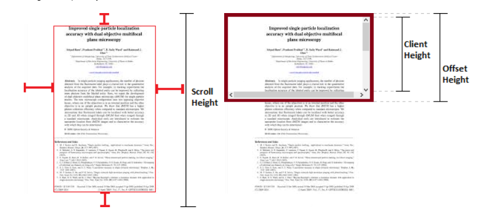

## scrollHeight vs clientHeight vs offsetHeight

- `scrollHeight` : ENTIRE content & padding (visible or not)

  - Height of all content + paddings, despite of height of the element.

- `clientHeight` : VISIBLE content & padding

  - Only visible height: content portion limited by explicitly defined height of the element.

- `offsetHeight` : VISIBLE content & padding + border + scrollbar

  - Height occupied by the element on document.

- [scrollHeight vs clientHeight vs offsetHeight](https://stackoverflow.com/questions/22675126/what-is-offsetheight-clientheight-scrollheight)

---

